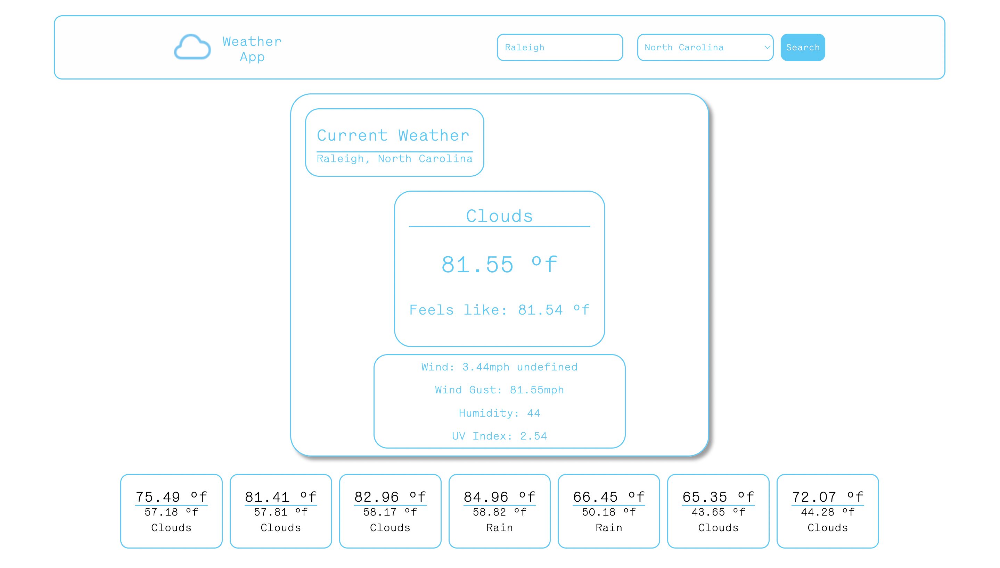

# Weather App



## Deploy Link
<a href="https://dubosews.github.io/06-Weather-App/">``` https://dubosews.github.io/06-Weather-App/ ```</a>

## Table of Contents
  1. [Description](#description) 
  2. [Installation](#installation)
  3. [Usage](#usage)  
  4. [Contributing](#contributing)
  5. [Tests](#tests)
  6. [License](#license)
  7. [Questions](#questions)
  8. [E-mail](#e-mail)

## Description
This application is a basic tool that displays the current weather and forecast for most locations. This app uses the ```One Call API``` from ```OpenWeather``` to fetch the weather data for the desired city. It also uses the ```Geocoding API``` from ```OpenWeather``` to convert the entered city name and state into lattitude and longitude coordinates, which is needed for the ```One Call API``` in order to get specific location weather data. The way this application was written, if you want to see the weather data for multiple cities, you must refresh the page after each search. 

## Installation
This application was built in javascript to display on a basic HTML webpage. *No installation Necissary*. To view, Open the ```index.html``` file in your default browser.

## Usage
To use this application, you can enter the name of the city that you would like to the the current/ forecasted weather for in the search bar at the top of the page. Then use the dropdown box to select the state that the city is in. Then click the search button to initiate the requests and fetch the data, which is then organized and displayed on the screen. ```Refresh the Webpage Before Each Search.```

## Contributing
if you would like to contribute to this project feel free to reach out through github. See further instructions below. 

## Tests
There are no tests designed for this project.

## License
 

## Questions
[github icon](./github-icon-small.png)
Github Profile: [dubosews](https://github.com/dubosews)
Contact Email: [wsd10205@gmail.com](mailto:wsd10205@gmail.com)
Directions for reaching out with further questions:
    If you would like to reach out to me with question via email, please include the repository title in the subject line of the email. 
